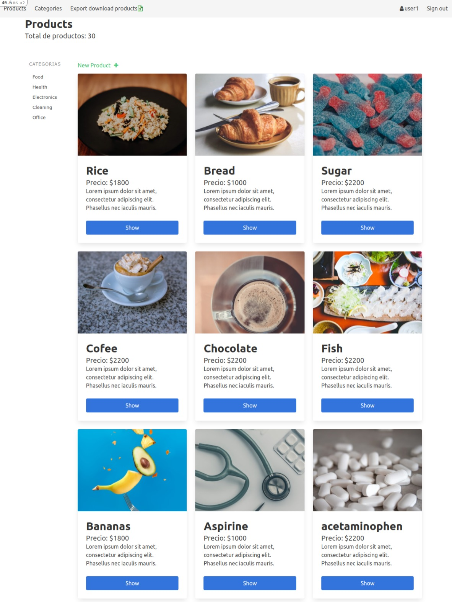
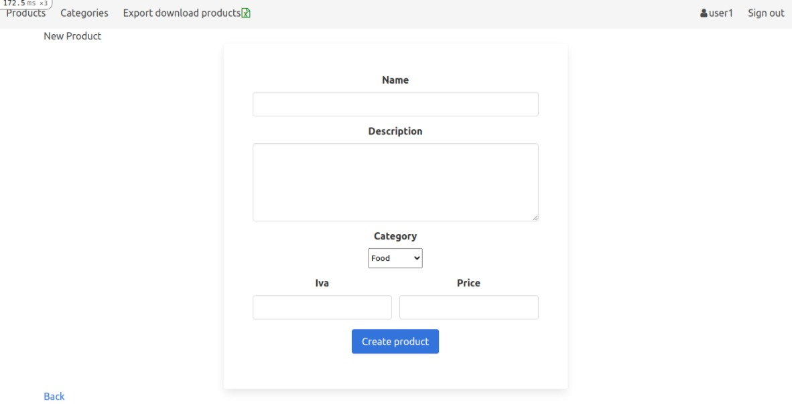

# Catalgue
This is a catalogue app, any user is presented with the homepage and could see the website, but, only loging user could change de database in to the app and dowmload (export) the full catalogue in a `.xlsx` file (spreadsheet).

Each page uses the same top menu and footer, include links to pages that are implemented: Home, products categories, create category and product, and sing out. The home page have a list of all products.

  
The home page also, list all categories in an asyde, and display in cards prodcuts name, price and description, with a button to show more datails view and also be able to edit, destroy prodcuts.

   


When the user clicks the category name they can see all products in that category, will see products sorted by most recent.


When the user click on new product, new category or to edit those:
A form with all necessary fields is displayed.



And also this webpage it's responsive.


## :computer: Built With

- Ruby v2.7.2
- Ruby on Rails v6.1.3

## :computer: Tested With
- Rspect

## :computer: Deployed With
- Heroku

## Live Demo

[Catalogue](https://guarded-eyrie-47853.herokuapp.com/)

## :wrench: Getting Started
> Take a copy of this project locally
- Go to the main page of the repo.
- Press the "Code" button and get the repo link.
- Clone it using git clone. 
```
git clone 'repo_link' 
```

### Setup
Open the terminal in the current project folder and then

1. Instal gems with:

```
1 | bundle install
```
** for some cases you must bundle it with 2.1.4 using ```1 | bundle _2.1.4_ install``` to avoid problems with Heroku **

2. Setup database with:

```
   1 | rails db:create
   2 | rails db:migrate
```
then go to app/models/article.rb and disable  validates :image, presence: true
must looks like 
>  #validates :image, presence: true
```
1 | rails db:seed
```
and now enable again the disable validation
must looks like:
>  validates :image, presence: true

### Github Actions

To make sure the linters' checks using Github Actions work properly, you should follow the next steps:

1. On your recently forked repo, enable the GitHub Actions in the Actions tab.
2. Create the `feature/branch` and push.
3. Start working on your milestone as usual.
4. Open a PR from the `feature/branch` when your work is done.

### Usage

Start server with:

```
    1 | rails server
```

Open `http://localhost:3000/` in your browser.

### Run tests

```
    1 | rpsec
```

### Deployment

To deploy it, you can use Heroku. 
1. First you will need a Heroku account and set-up for deployment.
1.1. Go to the [heroku website](https://www.heroku.com/) and create an account using the same email address you used for GitHub and Git.
1.2. Run this command 
  ```
  1 | curl https://cli-assets.heroku.com/install.sh | sh
  ```
1.3. Run this command
  ```
  1 | heroku keys:add
  ```
press y and then Enter, and now, type in the email address you used to create your Heroku account and press Enter. Then, type in the password for your Heroku account. Next, press y and Enter to allow Heroku to upload your public SSH key.
1.4. The terminal may read Invalid credentials provided. Just press any key and the Heroku website will open in your browser. Log in with the information you created your account with, and the terminal will reappear and accept your public SSH key.

2. Once you complete the first step.
2.1. Run this command
``` 
1 | heroku create
```
2.2. Then run
```
1 | git remote
```
Check that you see heroku in the output.
2.3. Push to heroku typing 
```
1 | git push heroku HEAD:master
```
2.4.
And we need to migrate the database to 
Run this command
```
1 | heroku run rails db:migrate
```
then go to app/models/article.rb and disable  validates :image, presence: true
must looks like 
>  #validates :image, presence: true
```
1 | heroku run rails db:seed
```
and now enable again the disable validation
must looks like:
>  validates :image, presence: true
2.5. Enjoy this app
```
1 | heroku open
```

## Author
**Gustavo Sanmartin** :bird:
- GitHub: [@gasb150](https://github.com/gasb150)
- LinkedIn: [Gustavo Sanmartin](https://www.linkedin.com/in/gustavsanmartin/)

## 🤝 Contributing

Contributions, issues, and feature requests are welcome!

Feel free to check the [issues page](issues/).

## Show your support

Give a ⭐️ if you like this project!


## 📝 License

<p>This project is <a href="LICENSE">MIT</a> licensed.</p>